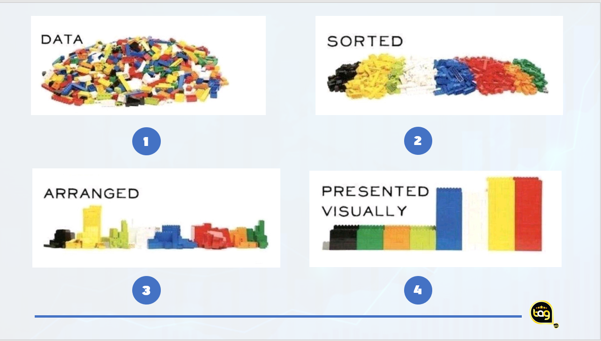
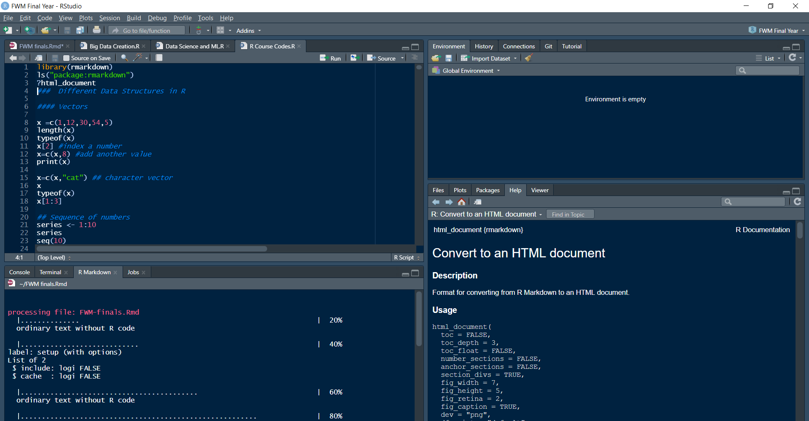
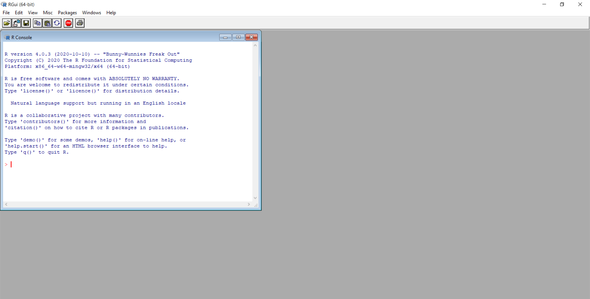
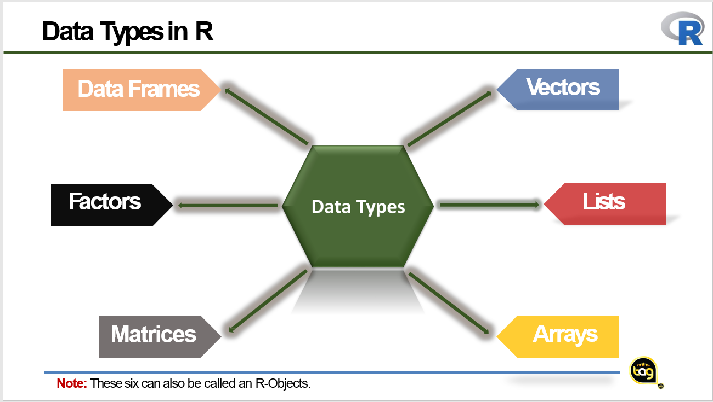
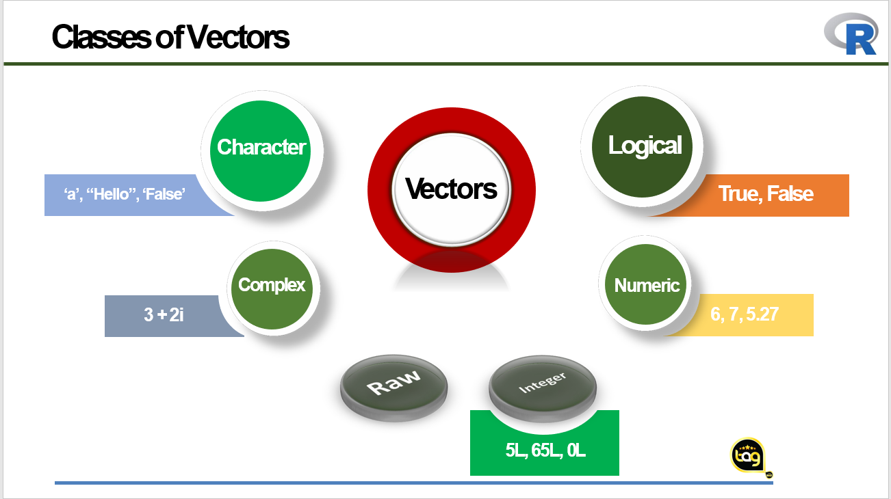
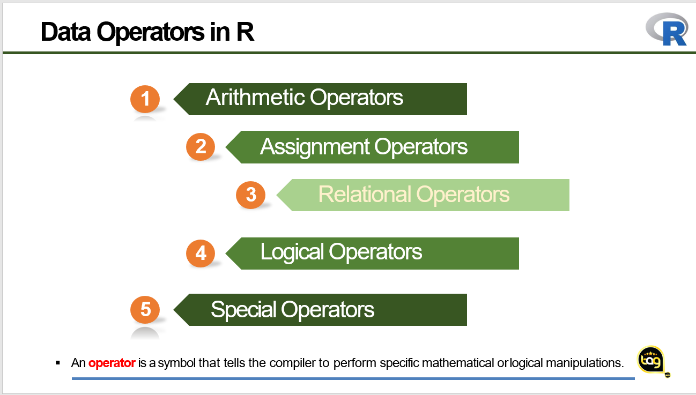
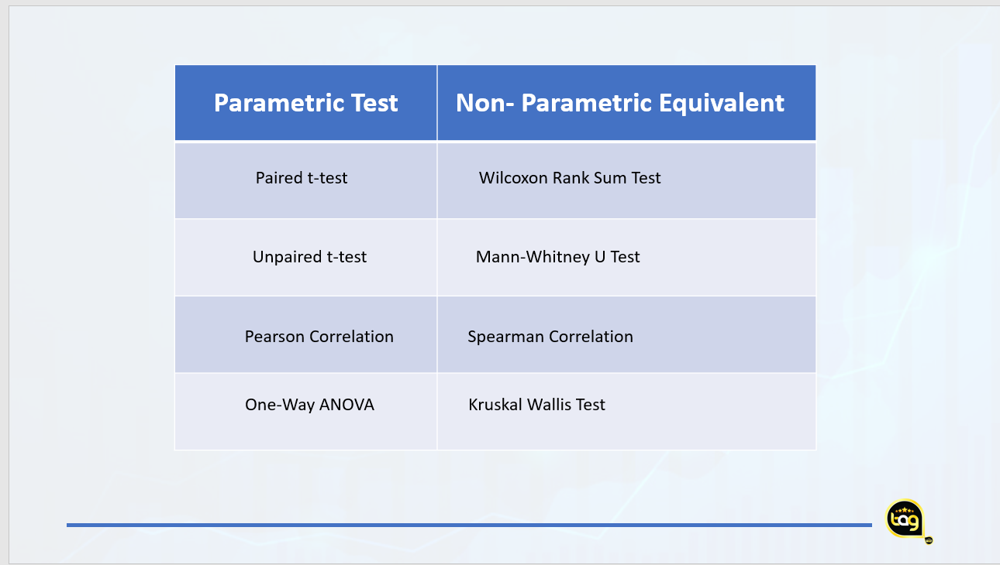

```{r setup, include=FALSE, cache= FALSE}
knitr::opts_chunk$set(
  comment = NA,
  warning = FALSE,
  message = FALSE,
  fig.path = "FWM Final Year/RTest/")
```

## **SEMINAR OUTLINE**

- Data Analysis Overview
- Introduction to R Studio
- Statistics, Data and Variable
- Analysis and Reporting with R
- Visualization Techniques with R
- Conclusion

### **Data Analysis Overview**

```{r DA, fig.cap="**Figure 1:** Simple Analogy to describe Data Analysis", out.width = '100%', echo=FALSE}

```

The above figure has completely simplified the task we have for today. Looking at the figure very well, we will notice that everything revolves round the very important word that we will first consider in today's seminar. The word **DATA**.

- **Defining a Data**

**Data** is a common word for every analyst but what exactly does it mean. It is a **collection of facts**, such as numbers, words, measurements, observations or just descriptions of things. 

- **Data Collection**

Getting some of these information has become easy in our modern world with the advent of smartphones and computers that has ability to do myriads of things such as gathering data on emails, sales, heartbeat, distance covered, tree heights etc

- **What then is Data Analysis?**

With respect to the figure above, **data analytics** is the analysis of data, whether huge or small, in order to understand it and see how to use the knowledge hidden within it.

**Data analysis** is a *process* of inspecting, cleansing, transforming, and modeling data with the goal of discovering useful information, informing conclusions, and supporting decision-making.

A simple example I used often in most of my trainings is on recorded information on the depth of a river and the possible knowledge to derive from it for swimmers.

Another example is what happens when we study. Consciously or unconsciously, we feed our system with data, that is the content of any materials or textbooks we are reading at that moment and by default our brain process this information, refine and it gradually begin to guide our actions and decisions.

In the next topic, we will learn more on R Studio, how to generate random data in R and finally, how to import and export data in R. Let's go friends. 


### **Introduction to R Studio**

There are many data analysis tools that can be used in analysing data with the aim of deriving useful insight from it. Some of which are: SPSS, Excel, EasyFit, Stata, PSPP, Octave, Matlab, Minitab, Statistica, SAS, Tableau, Python etc.

For the purpose of this seminar, we will be sticking close to the use of R programming software. This is because of the following advantages;

- Flexible, easy to learn and friendly graphical capabilities.
- Effective data storage facilities.
- Large number of free packages available for data analysis. We can also build ours.
- Provides all the capabilities of a programming language.
- Supports getting data from different types of sources.
- Interesting of all, it is **FREE**. Isn't this amazing?

R Studio is an Integrated Development Environment **(IDE)** for the base R. Let us have a look at a typical R Studio environment as shown below;

```{r RS, fig.cap="**Figure 2:** A Typical R Studio Environment", out.width = '100%', echo=FALSE}

```

It is very important I talk on the concept of appearance as evident in the background colour I used in Figure 2 which is far different from the default white background colour on your system as a new R User. With some few tricks around the tools, this can be easily changed to your desired colour.

The environment is such a friendly one with a default three (3) panes when the software is first opened. The last pane, most times the editor pane where you write your codes and comments can be created using the file option on the menu bar. We will dwell more on this extensively when we get to session of data analysis with R by God's grace.

**Installing R**

R is freely available for all the major computing platforms such as macOS, Windows and LINUX.

**Base R**

- Visit the official R site at <https://cran.r-project.org>
- Select the operating system of your choice and then click on the download tab
- Run the installer and follow the instructions to successfully install the software.

After you successfully install the software, you should see something like what we have in the figure below;

```{r BS, fig.cap="**Figure 3:** A Typical R Environment", out.width = '100%', echo=FALSE}

```

**NOTE:** The base R is required for R studio to function effectively.

**R Studio**

- Visit the official R Studio website at <https://rstudio.com>
- Click the product option
- Select your server version or desktop version
- Select your OS and click on the download button
- Run the installer and follow the instruction

**NOTE:** If the base R is not first installed, you might be directed to a website to do this before the R Studio can work effectively.


### **Statistics, Data and Variable**

- **Statistics**

Statistics is the practice of turning data into information to identify trends and understand features of populations. 
One of the most important keywords from the definition above is **Data** and **Information**.

This can be best seen with the concept of **Input** (raw) and **Output** (refined). The first thing every statistical analyst will always face in the course of performing data analysis is dealing with **raw data** - in other words, the records or observations that make up a sample. These data could be stored in a specialized **R object**.

- **Data**

At this section, we will look more into R Objects.

- **Data Types in R**

```{r DT, fig.cap="**Figure 4:** Data Types in R", out.width = '100%', echo=FALSE}

```

- **Vector**

A vector is a sequence of data elements of the same basic type. When you want to create vector  with more than one element, you should use **c()** function which means to **combine** the elements  into a vector.

```{r}
v <- c(1,2,3) # Hit the run button to the line of code or press Ctrl + Enter
print(v)
class(v)

ba <- c("FWM","AQFM","WMA")
print(ba)
class(ba)
```


**Basic Interpretation of information on the environment and console panes**

```{r}
## The concept of indexing
ba[2]
v[3]

## The > sign on the console means R is ready for a new command.
## If it shows a + plus sign, it means the code is incomplete.

## The concept of replacement
ba[2] <- "EMT"
v[3] <- 5

print(ba)
print(v)

## The concept of continuous replacement
v[1:2]

## Boolean or Logical Masking using comparison operators
v <- c(100,200,300,400)
v[v>200]
v[v>=200]
v[v<200]
v[v<=200]

my.true <- v>=300
v[my.true] ## It means from v, index out the true values of the object my.true. This is more like filtering

## The concept of sorting
basal_area <- c(30,25,12,37,40)
sorted_ba <- sort(basal_area)
print(sorted_ba)
desc_ba <- sort(basal_area, decreasing = TRUE )
print(desc_ba)

## Adding another value
basal_area <- c(basal_area, c(30,24,30))
print(basal_area)

## Inbuilt function
length(basal_area)
typeof(basal_area)

## The concept of sequencing
bl <- seq(5,7, by = 0.4)
print(bl)

## Coercing a vector into different data types
vt <- c(basal_area, "ba")
print(vt)
length(vt)
class(vt)

vt <- vt[-6]
print(vt)
class(vt)

vt <- vt[-8]
print(vt)
length(vt)
class(vt)

vt <- as.numeric(vt)
length(vt)
class(vt)
```


The simplest of the R-objects is the **vector object** and there are six data types of these atomic vectors, also termed as **six classes of vectors**. The other R-Objects are built upon the atomic vectors.

```{r COV, fig.cap="**Figure 5:** Six classes of vectors", out.width = '100%', echo=FALSE}

```


- **List**

A list is an R-object which can contain many different types of elements inside it like vectors, string, numbers, functions and even another list inside it.

```{r}
l <- list(2,"FWM",2+5i,FALSE,5)
print(l)
class(l)

l2 <- list(1,2,"FUNAAB")
class(l2)

l3 <- c(l,l2)
print(l3)
class(l3)

l3[4]
```


- **Arrays**

An arrays are the R Data Objects which can store data in more than two dimensions.
It takes vectors as input and uses the value in the dim parameter to create an array.

```{r}
a<-array(c(2,3,1),dim=c(2,3,3)) ## Row, column and frequency
print(a)
```

Let us modify the code a little as shown below;
```{r}
a<-array(c(2,3,1),dim=c(2,3,3,2))
class(a)
print(a)

## Compare the above with this code below
a<-array(c(2,3,1),dim=c(2,3,6))
print(a)
```

- **Matrices**

They are similar to an array but only store data in two dimensions. Let us take a look at some brief examples.

```{r}
vtr<-c(1,2,3)
vtr1<-c(4,5,6)
mtr<-matrix(c(vtr,vtr1),3,3)  
print(mtr)

volume <- c(12,15,10,11,13,12)
cv <- matrix(volume, 3,2)
class(cv)
print(cv)
```

**cbind and the rbind function**

As the names implies, cbind means column binding while rbind means row binding. This approach is used when combing multiple vectors together to form a matrix or an array of two or more dimensions.

```{r}
Girth <- c(1,2,3,4,5)
Height <- c(6,7,8,9,10)
Volume <- Height/2

tree_data <- c(Girth, Height, Volume) ## vectorising
print(tree_data)

tree_data <- rbind(Girth, Height, Volume)
print(tree_data)

## Adding Column Names
locations <- c("loc1","loc2","loc3","loc4","loc5")
colnames(tree_data) <- locations
print(tree_data)

## Chnaging row names
rownames(tree_data)[1] <- "Basal Area"
print(tree_data)

rownames(tree_data)[3] <- "M Volume"
print(tree_data)

## Other useful inbuilt functions
colSums(tree_data)
rowSums(tree_data)
colMeans(tree_data)
rowMeans(tree_data)
nrow(tree_data)
ncol(tree_data)

## Indexing with matrices
tree_data[2,3]
tree_data[1,] ## first role only
tree_data[1:2,] ## first two roles only
tree_data[,1] ## first column only
tree_data[,1:2] ## first two columns only

## A matrix can easily be coerced to form a data frame.
```


- **Factors**

Factors are the data objects which are used to categorize the data and store it as levels. They are useful in **data analysis for statistical modelling**.
Factors are created using the factor() function. The **nlevels** functions gives the count of levels. Let us work around some examples.

```{r}
species <- c("gmelina", "tectona", "gmelina", "azadiracta", "mangifera")
factor(species)
nlevels(factor(species))
levels(factor(species))

### Ordinal categorical variable

temp <- c("cold","hot","med","hot","hot", "cold")
factor(temp)

temp_R <- factor(temp, ordered = T, levels = c("cold","med","hot"))
temp_R
class(temp_R)
nlevels(temp_R)
summary(temp_R)
```

- **Data Frames**

Data frames are tabular data objects created with the **data.frame()**.
Unlike a matrix in data frame each column can contain different modes of data. It is one of the favourite way of creating tables in R.

```{r}
SN <- c(1:5)
Gender <- c("Male","Male","Female","Male","Female")
Names <- c("Olakunle","Ademola","Tolu","Samson","Lizzy")  
Age <- c(24,22,20,28,21)
Class2016 <- data.frame(SN,Gender,Names,Age)
print(Class2016)

## Same way as above
tree <- data.frame(Girth=c(2,5,4), Height=c(10,7,11), Volume=c(0.34,.43,.56))
class(tree)
print(tree)

## Assessing columns of a data frame
tree$Girth ## The girth column alone
tree[1,2] ## first height observation

## Getting the names of columns in a data frame
names(tree)

## structure of a data frame
str(tree)

## summary function on a data frame
summary(tree)

## Free R datasets for practice
data()
data(package="datasets")
library(help="datasets")
data("ChickWeight")
str(ChickWeight)
summary(ChickWeight)
head(ChickWeight)
tail(ChickWeight)
```

- **Data Operators in R**

```{r DO, fig.cap="**Figure 6:** Data Operators in R", out.width = '100%', echo=FALSE}

```

- **Arithmetic Operator**

This operator gives us the privilege of using R as a basic calculator. Briefly, we will take some examples performing some basic calculations with this operator.

```{r}
2+5
vec1 <- c(1,2,3)
vec2 <- c(4,5,6)

print(vec1 + vec2) ## Addition
print(vec1 - vec2) ## Subtraction
print(vec1 * vec2) ## Multiplication
print(vec2 / vec1) ## Division
print(vec2 ^ vec1) ## Power
print(vec2 ** vec1) ## Similarity with python power.
print(vec2 %% vec1) ## Modular division (Remainder)
print(vec2 %/% vec1) ## Flow division (Whole number)

```

- **Assignment Operator**

During the section on data types, in one of the examples, we have used the assignment operator to create a variable. Therefore, we will only do little of variable creation using the different types of assignment operators available in R.

```{r}
vec1 <- c(1,2,3) ## Less than assignment operator
vec1 <<- c(1,2,3)
c(4,5,6) -> vec2 ## greater than assignment operator
c(4,5,6) ->> vec2
vec1 = c(1,2,3) ## equal to assignment operator
```

- **Relational Operators**

```{r}
vec1 < vec2
vec1 > vec2
vec1 <= vec2
vec1 >= vec2
vec2 == vec2
vec1 != vec2

```

- **Logical Operators**

**AND**
```{r}
2&3 ## prints TRUE only if both sides are TRUE
0&1
TRUE & TRUE
TRUE & FALSE
FALSE && FALSE
TRUE && TRUE
TRUE && FALSE
```

**OR**
```{r}
2|3 ## prints TRUE as long one of the sides is TRUE
0|1
TRUE | TRUE
TRUE | FALSE
FALSE || FALSE
TRUE || TRUE
TRUE || FALSE
```

**Opposite**
```{r}
!0 ## It gives the opposite logical values
!6
!TRUE
!FALSE
```

- **Special Operators**

**:**

It creates the series of numbers in sequence for a vector.

```{r}
v <- c(1:15)
class(v)
```

**%in%**

This operator is used to identify if an element belongs to a  vector.

```{r}
vec2 %in% v
```

**%*%**

This operator is used to multiply a matrix with its transpose.

```{r}
M = matrix( c(2,6,5,1,10,4),
nrow=2,ncol=3,byrow = TRUE)

t = M %*% t(M)  
print(t)

```


**General View on Variable**
A variable is a characteristics of an individual in a population, the value of which can differ between entities within that population.

- **Types of Variable**

**Numeric Variable:** This is one whose observations are naturally recorded as numbers. They are of two types: Continuous and Discreet.

- **Continuous:** They can be recorded as any value in some interval, up to any number of decimal. e.g 15.12mm.

- **Discrete:** It takes only distinct numeric values – and if the range is restricted, then the numbers of possible values is finite. For example, it doesn’t make sense to observe 15.245 heads if you are to observe the number of heads in a 20 flip of a coin.


**Categorical Variable:** Like some discrete variables, categorical variables takes only one of a finite number of possibilities. Unlike discrete variables, however, categorical observations are not always recorded as numeric values. 

There are two types of categorical variables. They are:

- **Nominal:** Those that cannot be logically ranked. e.g sex. 
Sex has two categories. The order of these categories is irrelevant.
```{r}
head(chickwts$feed)
```

- **Ordinal:** They are variables that can be logically ranked. e.g drug dosage with possible values of low, medium and high. The values can be ordered in either increasing or decreasing amount depending on the nature of the research.


- **Variables in R**

Variables are nothing but reserved memory locations to store values. This means that when you create a variable, you reserve a space in the memory.

- **Finding Variables in R**

To know all the variables currently available in the workspace we use the **ls()** function. Also the **ls()** function  can use patterns to match the variable names.
Run the command **print(ls())**

- **Removing Variables in R**

**print(ls(pattern="var"))** this command will produce variables starting with the pattern "var".

Variables can be deleted by using the **rm()** function.


### **Data Analysis and Reporting with R**

In this section, it will be more of practical on the procedure to deriving meaningful insight from your data with R.

**Getting and Setting Working Directory**

This is an important step we need to take before conducting any kind of analysis with R. What we will be doing here is knowing the exact folder on the system that our software is connected to. It is important we do this because our software will only be able to read in data from that folder and also write out to that same folder when necessary.

There are two ways to doing this. Either **manually** with the help of some inbuilt functions, or through **Session** column on the menu bar.

- **Manually**

```{r}
getwd() ## To get working directory
## setwd(dir= "C:/Users/HP Envy X360/OneDrive/Documents/FWM Final Year/NEW FOLDER")
## The forward slash is used to direct from one folder to the other.
```

**Importing and Exporting of Data in R**

- **.CSV**


```{r}
dat <- read.csv("StudentsPerformance.csv", header = T)
head(dat[-1]) ## excluding the first column
str(dat)
```


- **.txt**

```{r}
## dat1 <- read.table("table.txt", header = T)
```

- **Excel Files**
```{r}
library(readxl)
## example <- read_excel("example.xls")
## head(example)
```

```{r}
## excel_sheets("UnderG data.xlsx") ## To get the name of sheets
## each sheet is more like a data frame.

## read_excel("UnderG data.xlsx", sheet = "Sheet2")
```

**NOTE:** An easy way to import datasets is via the Global Environment or through the file pane.

- **Using RCurl to read in csv data hosted online or on github**

```{r}
library(RCurl)

 ## dat2 <- read.csv(text = getURL("https://raw.githubusercontent.com/sciruela/Happiness-Salaries/ac87cac0e1b440826eaa765e1b2c3e6bc264dad1/data.csv"))

## head(dat2)
```


**Indexing and Subsetting Data Frames**

```{r}
data(iris)
str(iris)
summary(iris)
summary(iris$Species)
head(iris)
head(iris,10)

df3 <- iris[1:6,] ## To subset or isolate the first 6 rows.
head(df3)
df4 <- iris[,1:2] ## subset the first two columns
head(df4)
y <- iris[, c("Sepal.Length","Sepal.Width")]
head(y)

```

**Indexing with relational operators**

```{r}
head(mtcars[mtcars$cyl==6 & mtcars$am==1,])
head(mtcars[mtcars$cyl==6 | mtcars$am==1,])
head(mtcars[mtcars$mpg>20 & mtcars$cyl==6 & mtcars$gear==3, ])
head(mtcars[mtcars$mpg>20 | mtcars$cyl==6 | mtcars$gear==3, ])

head(mtcars[ (mtcars$mpg>20) & (mtcars$hp>100), c('mpg','cyl')])

vit <- c("Sepal.Length", "Petal.Length", "Species")
df5 <- iris[vit]
head(df5)
vit1 <- names(iris)%in% c("Species")
vit1
df6 <- iris[!vit1]
head(df6)

```

**Indexing with the subset function**

```{r}
dfset <- subset(iris, iris$Species=="setosa")
head(dfset)

head(subset(mtcars, mpg>20 & cyl==6, c("mpg","cyl","disp")))
```

**Exploratory Data Analysis (EDA)**

Exploratory Data Analysis refers to the critical process of performing initial investigations on data so as to discover patterns, to spot anomalies, to test hypothesis and to check assumptions with the help of summary statistics and graphical representations.


- **Univariate**
When discussing or analyzing data related to only one dimension, you are dealing with Univariate Data.

For example, the weight variable in the earlier example **(chickwts)** is univariate since each measurement can be expressed with one component – a single number.

```{r}
foo <- c(0.6,-0.6,0.1,-0.2,-1.0,0.4,0.3,-1.8,1.1,6.0)
plot(foo,rep(0,10),cex=2,cex.axis=1.5,cex.lab=1.5)
```

From the above EDA example with a univariate data, we were able to see an abnormal observation in the data popular called an **outlier**.

```{r}
hist(iris$Sepal.Length)
boxplot(iris$Sepal.Length, main="Summary of Iris", xlab="Sepal Length")
summary(iris)
str(iris)
```


**Multivariate Data**

When it is necessary to consider data with  respect to variables that exists in more than one dimension ( in other words, with more than one component or measurement associated with each observation), your data are considered Multivariate.

```{r}
head(quakes)
summary(quakes)
str(quakes)
```

**Decriptive Statistics**

Descriptive statistics is the term given to the analysis of data that helps **describe**, show or summarize data in a meaningful way such that, for example, patterns might emerge from the data. 

Descriptive statistics do not, however, allow us to make conclusions beyond the data we have analysed or reach conclusions regarding any hypotheses we might have made. They are simply a way to describe our data.

- **Measures of Central Tendency**

These are ways of describing the central position of a frequency distribution for a group of data.

```{r}
x <- rnorm(1000,3,.25)
hist(x) ## distribution of values of continuous variables
mean(x)
median(x)

y <- c(2,5,6,3,7,800,5,3,2,4)
mean(y) ## here, the mean is not a true representative of the salaries, so we report the median
median(y)

vab <- table(y) ## To have an idea of the modal value.
vab
mod <- vab[vab==max(vab)]
mod

min(y)
max(y)
range(y)

```

You can get a copy of my book on amazon titled; ["Basic Statistics for Undergraduate Studies Using R"](https://www.amazon.com/BASIC-STATISTICS-UNDERGRADUATE-STUDIES-USING/dp/B08C4FTJFT) for more information on simple code to obtain the mode of your distributions.

```{r}

library(moments)
skewness(x)

## Skewness
## Left Skewed: Mean < Median
## Few smaller values reduces the mean

## Right Skewed: Mean > Median
## Few larger values increases the mean

```

- **Measure of Spread**

These are ways of summarizing a group of data by describing how spread out the scores are.

```{r}
#### MEASURE OF VARIATION
std = sd(iris$Sepal.Length)
std

var(iris$Sepal.Length)

library(sciplot)
se(iris$Petal.Length)

boxplot(iris$Petal.Width, Main = "Petal Length", ylab = "Length") ## 5 point number summary.

IQR(y)
```


**Inferential Statistics**

Inferential statistics use a random sample of data taken from a population to describe and make inferences about the population.

- **Parameter and Statistics**

We have seen that descriptive statistics provide information about our immediate group of data. Any group of data like this, which includes all the data you are interested in, is called a population. Descriptive statistics are applied to populations, and the properties of populations, like the mean or standard deviation, are called parameters as they represent the whole population (i.e., everybody you are interested in).

Often, however, you do not have access to the whole population you are interested in investigating, but only a limited number of data instead which is called the sample.

Properties of samples, such as the mean or standard deviation, are not called parameters, but statistics. Inferential statistics are techniques that allow us to use these samples to make generalizations about the populations from which the samples were drawn. It is, therefore, important that the sample accurately represents the population. The process of achieving this is called sampling.

The methods of inferential statistics are **(1) the estimation of parameter(s)** and **(2) testing of statistical hypotheses**.

- **Summary:**

The characteristics of that population are referred to as parameters.
Estimates from a sample are known as statistics.

**Parametric and Non-parametric test**

Parametric tests are those that make assumptions about the parameters of the population distribution from which the sample is drawn but nonparametric tests don’t require that your data follow the normal distribution. They’re also known as distribution-free tests and can provide benefits in certain situations.

Non-parametric tests are valid for both non-Normally distributed data and Normally distributed data, so why not use them all the time?
Parametric tests usually have more statistical power than their non-parametric equivalents. In other words, one is more likely to detect significant differences when they truly exist.

```{r PNP, fig.cap="**Figure 7:** Parametric and non-parametric tests for comparing two or more groups", out.width = '100%', echo=FALSE}

```

- **Hypothesis**

This is defined to be an assumption made with aim of calculating the probability of which the conc(lusion is incorrect. We have two types of it, they are;
1. Null hypothesis
2. Alternate hypothesis

The null hypothesis is the claim that is assumed to be true while the alternate hypothesis is what we are testing for against the null hypothesis.

**NOTE**

-When H(alt) is define with the less than statement, it is one-sided and can be said to be a lower-tailed test.

-When H(alt) is defined with the greater than statement, it is one-sided and can also be said to be an upper-tailed test.

-When H(alt) is defined with the not equal to sign, it is two-sided and can also be called a two-tailed test.

- **Hypothesis Testing**

After setting up a hypothesis, it is good for us to make some assumptions before carrying out the parametric test. These assumptions are listed below;

- We assume that the samples are taken at random and gives a perfect representation of the population without any element of bias.

- For two or more populations, we assume the equality of variance.

-  We assume that the population(s) is normally distributed.

**t-Test Application in R**

- **One Sample t-test**

**Example**

Ten individual trees were randomly chosen from a population and their diameters at 1.3m above the ground level were measured in cm. The data is presented below;

25.46,31.51,17.04,30.10,38.40,31.19,37.56,41.70,21.01 and 41.83

In the light of the above dta, could the mean diameter of the population be 28cm?

```{r}
dat <- c(25.46,31.51,17.04,30.10,38.40,31.19,37.56,41.70,21.01,41.83)
dbh_test <- t.test(x=dat, mu=28, alternative = "less")
print(dbh_test)

names(dbh_test)
attributes(dbh_test) ##same as above

## To get the true C.I, we need to change the alternative argument to two sided.
dbh_test1 <- t.test(x=dat, mu=28, alternative = "two.sided")
names(dbh_test1)
dbh_test1$conf.int
```

- **Exercise**

Suppose a forester sells 16g of a tree seedling. A random sample of 9 seedlings were taken and weighed.
15.5, 16.2, 16.1, 15.8, 15.6, 16.0, 15.8, 15.9, 16.2

Is the average weight at least 16?

**Answer**

```{r}
seedling <- c(15.5, 16.2, 16.1, 15.8, 15.6, 16.0, 15.8, 15.9, 16.2)
s_test <- t.test(x= seedling, mu= 16, alternative = "less")
print(s_test)
```

- **Unpaired/Independent Samples**

**Unpooled Variance**: Here, we cannot assume the equality of variances of the two groups.

**Example**

Suppose the forester in the exercise above selects another 6 random samples of seedling and weighed them.
14.7, 15.2, 16.6, 16.3, 15.4, 16.4

Can we conclude that there is a difference between the mean of the two samples?

```{r}
seedling_samp <- c(14.7, 15.2, 16.6, 16.3, 15.4, 16.4)

testObj <- t.test(x=seedling_samp, y=seedling, alternative = "greater", conf.level = 0.95)
print(testObj)
```

**Pooled**: Here, we can assume equality of variance.

**Example**

Measurements on tree diameters from two different forest reserves were taken and recorded with the aim of accessing whether there is a difference between the mean diameter values obtained from the forest reserves. Perform a simple test confirming this.

shasha: 102,87,101,96,107,101,91,85,108,67,85,82
Ago-Owu: 73,81,111,109,143,95,92,120,93,89,119,79,90,126,62,92,77,106,105,111

```{r}
shasha <- c(102,87,101,96,107,101,91,85,108,67,85,82)
ago_owu <- c(73,81,111,109,143,95,92,120,93,89,119,79,90,126,62,92,77,106,105,111)
testResult <- t.test(x=shasha, y=ago_owu, alternative = "two.sided", conf.level = 0.95, var.equal = T)
print(testResult)
```

- **Paired/Dependent Samples**

Paired data occur when the measurements forming tow sets of observations are taken from the same individual.

**Examples**

A forester interested in the rate of growth of his gmelina arborea plantation takes a yearly measurement of the height of his trees and record them. The record for the first and second year are provide below:

height before: 52,66,89,87,89,72,66,65,49,62,70,52,75,63,65,61

height after: 51,66,71,73,70,68,60,51,40,57,65,53,64,56,60,59

```{r}
height_before <- c(52,66,89,87,89,72,66,65,49,62,70,52,75,63,65,61)
height_after <- c(51,66,71,73,70,68,60,51,40,57,65,53,64,56,60,59)

length(height_before); length(height_after)
heightdiff <- height_after - height_before
print(heightdiff)

heightdiff_mean <- mean(heightdiff)
heightdiff_sd <- sd(heightdiff)

height_test <- heightdiff_mean / (heightdiff_sd/sqrt(16))
print(height_test)

p_val <- pt(height_test, df=15)
print(p_val)
```

Doing this with a single line of code as usual.

```{r}
testObject <- t.test(x=height_after, y=height_before, alternative = "less", conf.level = .95, paired = T)
print(testObject)
```

You can use the line of code below to get the confidence interval.

```{r}
CI <- heightdiff_mean + c(-1,1) * qt(0.975, df=15) * (heightdiff_sd/sqrt(16))
print(CI)
```

**NOTE:**

```{r}
## It can also be used to examine the relationship between a numeric outcome variable y and a categorical explanatory variable with 2 levels. (yes,no)

## boxplot(x~y)
## t.test(y~x, mu=0, alt="two.sided", conf= 0.95, var.eq=F, paired=F)

## t.test(y~x)
## t.test(y[x=="no"], y[x=="yes"])

```


**Equality of Variance Test**

```{r}
## First with a boxplot
## boxplot(y~x)  ensure both x and y are of the same length.

## var(y); var(x)
## var(y[x=="no]) ; var(y[x=="yes])

## Levene's test

## Null: Population variances are equal.
## library(car)
## leveneTest(y~x)
```


For chi-square analysis with R, please get a copy of my **book** ["Basic Statistics for Undergraduate Studies Using R"](https://www.amazon.com/BASIC-STATISTICS-UNDERGRADUATE-STUDIES-USING/dp/B08C4FTJFT).

- **One-way ANOVA**

```{r}
head(chickwts)
levels(chickwts$feed)
library(dplyr)
chick <- slice(chickwts, c(1:36))
names(chick)
str(chick)
levels(chick$feed)

stripchart(weight~feed, vertical= T, pch=19, data = chick, xlab="Feed type", method= "jitter", jitter = .004)

result <- lm(weight~feed, data = chick)
anova(result)
plot(result, which = 1)
## Here we can see that the overall variances are relatively homogenous for all the fitted values.

plot(result, which = 2) ## Normality assumptions
## Here we can see it follows the straight line except for a little skewness on top.
plot(result)

Res <- rstandard(result) ## for obtaining standardized residuals
hist(Res)
TukeyHSD(aov(result))
## soybean and horsebean contributes most of the overall significance between the feed type.

 ## Let us visualize this.
stripchart(weight~feed, vertical= T, pch=19, data = chick, xlab="Feed type", method= "jitter", jitter = .004)

library(agricolae)
DMRT <- duncan.test(chick$weight, chick$feed, 33, 2470.6)
print(DMRT)

LSD <- LSD.test(chick$weight, chick$feed, 33, 2470.6)
print(LSD)

```

- **Two-way ANOVA**

This is just an extension of the one-way ANOVA that examines the influence of two different categorical indepenedent variable on one continuous dependent variable.

* denotes interaction and : could be used as well. To add more than one predictor, the plus sign is used.

```{r}
## interaction.plot(c1, c2, response, xlab, ylab, trace.label=)

```


- **Correlation and Regression in R**

```{r}
df = mtcars
num.cols <- sapply(df, is.numeric)
cor.data <- cor(df[, num.cols])
print(cor.data)

## library(DT)
## datatable(cor.data, extensions = "buttons", options = list(
##  dom = "Bfrtip",
##  buttons = c("copy","csv","excel","pdf","print")
## ))

## Just for making a nice datatable with copy options.

```


```{r}
library(corrgram)
library(corrplot)

print(corrplot(cor.data, method = "color"))
```


### **Visualization Techniques with R**

- **The Plot Function**

For visualizing simple scatreplots. You can make reference to my new book for more examples of other plot functions.

```{r}
plot(trees$Girth,trees$Volume)
## To add title
plot(trees$Girth,trees$Volume, main = "Scatterplot of Girth and Volume")
## To add labels
plot(trees$Girth,trees$Volume, main = "Scatterplot of Girth and Volume",
     xlab = "Girth", ylab = "Volume")

```

- **ggplot2**

This is one of the most popular data visualization package for R created by Hadley Wickham. It follows a distict pattern of graphics and it builds on the ideas of adding layers.

**ggplot2 layers**

1. Data
2. Aesthetics
3. Geometry

```{r}
## Ensure ggplot2 package is installed on your software
library(ggplot2)
ggplot(data = mtcars) ## with this nothing will show up.
ggplot(data = mtcars, aes(x=mpg, y=hp)) ## data + aesthetics

pl <- ggplot(data = mtcars, aes(x=mpg, y=hp))
pl + geom_point() ## point for scatterplot geometry.
```


4. Facets
5. Statistics
6. Coordinates
7. Themes

```{r}
pl <- pl + geom_point()
pl + facet_grid(cyl~.) ## Multiple plots of mpg vs hp seperated by cyl levels

## Adding a smoot fit
pl + facet_grid(cyl~.) + stat_smooth() ## provides an error measure

## manipulating coordinates
pl2 <- pl + facet_grid(cyl~.) + stat_smooth()
pl2 + coord_cartesian(xlim = c(15,25)) ## For bringing in and out of the axes

## Themes
pl2 + coord_cartesian(xlim = c(15,25)) + theme_bw()
```

- **qplot**

```{r}
qplot(Sepal.Length, Sepal.Width, data=iris, color = Species)
## Graph shwoing the relationship btw length and width of 3 different species

qplot(Sepal.Length, Sepal.Width, data=iris)

qplot(Sepal.Length, Sepal.Width, data=iris, color = Species, size = Petal.Width)
## The bases for size is Petal width. So, Setosa have the smallest.

##Adding labels to the plot
qplot(Sepal.Length, Sepal.Width, data=iris, color = Species,
      xlab = "Sepal Length", ylab = "Petal Length",
      main = "Sepal Vs Petal Length in Iris Dataset")

qplot(Sepal.Length, Sepal.Width, data=iris, geom = "line", color = Species)
```

```{r}
## Distinguish between species using color scheme
ggplot(data = iris, aes(Sepal.Length, Sepal.Width)) + geom_point(aes(color = (Species)))
# OR
ggplot(data = iris, aes(Sepal.Length, Sepal.Width, colour = Species)) + geom_point()

ggplot(data = iris, aes(Sepal.Length, Sepal.Width, shape = Species)) + geom_point()
```

```{r}
## Histogram
ggplot(iris, aes(x= Sepal.Length)) +geom_histogram()

ggplot(iris, aes(x= Sepal.Length, fill = Species)) +geom_histogram()

## Boxplot
ggplot(iris, aes(x= Species, y= Sepal.Length)) + geom_boxplot()

## Visualizing relationship between variables for the 3 species
ggplot(data = iris, aes(Sepal.Length, Sepal.Width)) + geom_point() + facet_grid(. ~ Species)

ggplot(data = iris, aes(Sepal.Length, Sepal.Width)) + geom_point() + facet_grid(. ~ Species) + geom_smooth(method = "lm")
```


```{r}
library(MASS)
head(birthwt)

## compare numerical variables across all categories
ggplot(birthwt, aes(x= factor(race), y= bwt)) +geom_boxplot()

## Do you notice the presence of an outlier?
ggplot(birthwt, aes(x= factor(race), y= bwt)) +geom_boxplot() +ggtitle("Birthwt")
ggplot(birthwt, aes(x= factor(race), y= bwt)) +geom_boxplot() + coord_flip()
```

```{r}
### BARPLOT
library(ggplot2)
df <- mpg
head(df)
## Scatterplot have continuous data on the x but barplot have a categorical data.

## They both have counts on their y axis
pl <- ggplot(df, aes(x=class))
print(pl + geom_bar())
print(pl + geom_bar(color="blue")) ## for outline colour
print(pl + geom_bar(color="blue", fill="pink"))

## We can also define our fill with another factor column in the data frame. To do this, we will introduce the aes(inside the geom)
print(pl + geom_bar(aes(fill=drv))) ## This will automatically create a stacked bar for us.
print(pl + geom_bar(aes(fill=drv ), position = "dodge")) ## This helps in comparing
print(pl + geom_bar(aes(fill=drv ), position = "fill")) ## This shows the percentage instead of count
```


### **Conclusion**

R is such an interesting programming language for statistical analysis, amazing visualization and reporting possibilities. To learn more, you need to read more and practice more.


```{r KS, fig.cap="It's a great privilege.", out.width = '100%', echo=FALSE}

```


```{r BFS, fig.cap="Get your copy", out.width = '100%', echo=FALSE}

```